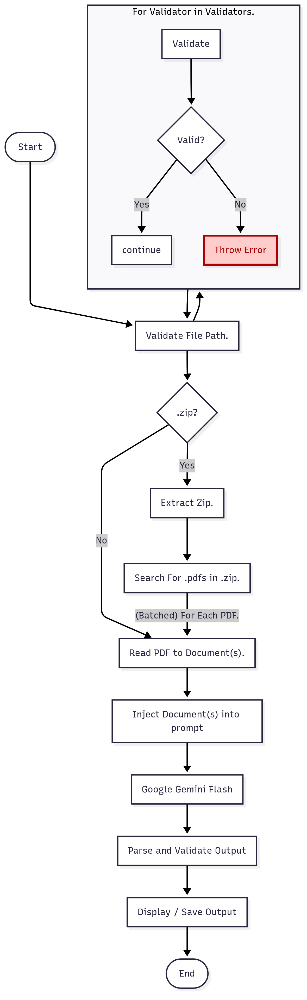

# EOB Extraction Process

EOB Extraction will be handled by a Langchain Chain (runnable sequence) that is created and configured at runtime. This chain will accept a file path as an argument and will return the JSON serializeable structured output extracted from the file(s).

## Functional Requirements

1. Chain accepts a file path as a parameter
2. The file path must point to an existing _.pdf_ or _.zip_ file
3. When the file is a _.zip_, all _.pdf_ files in the _.zip_ are processed.
4. The output structure should be the same for each processed file.
5. The layout of EOB files should not matter.
6. Missing data should be handled gracefully.

## Technical Requirements

1. The chain should use batching for _.zip_ files to improve efficiency.
2. Missing data should be included in outupt with a value of None.

## High Level Overview

At a high level the extraction chain will have three parts:

1. Ingestion
   - Validate Filepath
   - Ingest Document(s)
   - Convert to Langchain Document(s)
2. Extraction
   - Inject Document(s) into prompt(s)
   - Invoke LLM using Structured Output
   - Include static metadata from Document(s)
3. Output
   - Output JSON Data to some medium.

## Chain Workflow



## Prompting

The prompt for extracting EOB data is made up of two parts:

1. A system message to explain the AI's function.
2. A human message containing a formatted document.

### System Message

The system message prompt is broken into four parts:

1. **Persona**: Overview of the AI's purpose.
2. **Data Overview**: Overview of data to extract.
3. **Instructions**: Guidance on how to interpret the document / pages / data.
4. **Focused Guidance**: Important cases or instructions to consider.

The system message explains that the AI should act as an Insurance Document Analyst Specializing in EOBs. The task is to carefully extract all information required by the Affordable Care Act (ACA). The ACA requires by law that all EOBs (regardless of format) must contain certain information. The prompt then defines requirements for the data that the LLM should search for based on these ACA requirements. These fields are categorized and labeled with a description that aligns with the defined Structured Output class. Next, instructions for how to interpret the EOB document are provided. These instructions tell the LLM how to interpret data on different pages, in tables, in formats, etc. The final prompt section, focused guidance, reiterates important instructions to help prevent them from getting ignored due to context loss.

### Human Message

The human message prompt formats an EOB document for the LLM to extract data from. This prompt breaks the EOB content up into pages. For example a 2 page document would look like:

```
PAGE NUMBER: 1 of 2
PAGE CONTENT:
---
<the page content for page 1>
---
PAGE NUMBER: 2 of 2
PAGE CONTENT:
---
<the page content for page 2>
---
```
